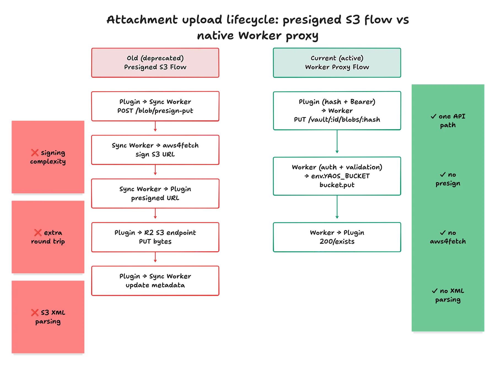
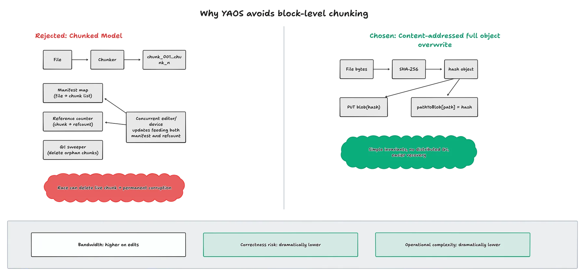

# Attachment Sync: Content-Addressing and Bounded Fan-Out

Markdown text belongs in the CRDT. Images, PDFs and other binary file-types are handled via a separate, content-addressed blob synchronization pipeline backed by Cloudflare R2 object storage.

### The Native Worker Proxy

Earlier iterations of YAOS used a complex two-phase commit involving S3 presigned URLs, because PartyKit's managed infrastructure obscured the underlying Cloudflare bindings, our server could not natively talk to our R2 storage bucket. We had to treat R2 like a generic external AWS S3 bucket.

The client would ask the server for permission, the server would cryptographically sign an AWS S3 fetch URL, and the client would talk directly to the bucket.

We deleted that brittle state machine. YAOS now utilizes direct native R2 bindings inside the Cloudflare Worker. The client computes the SHA-256 hash of the file and does a simple authenticated `PUT` directly to the Worker. The Worker then natively proxies the bytes to `env.YAOS_BUCKET`.

This native proxy approach drastically simplifies the client logic, eliminates the need for external `aws4fetch` signing libraries, and completely removes the need to parse S3 XML responses.

### Bounding the Cloudflare Fan-Out

When checking which blobs already exist in R2 (to achieve content-addressed deduplication), the naive approach is to use an unbounded `Promise.all(...)` fan-out to check multiple hashes at once.

This is an anti-pattern for Cloudflare Workers. A single Worker invocation is strictly limited to 6 simultaneous open connections. Native R2 operations—including `head()`, `get()`, `put()`, `delete()`, and `list()`—all count toward that absolute ceiling. Unbounded scatter/gather bursts consume the subrequest budget, create massive connection pressure, and cause the Worker to crash.

To solve this, YAOS uses a strict, concurrency-limited worker pool. Concurrent R2 operations are capped at 4. This intentionally sits below Cloudflare's 6-connection ceiling, ensuring the Worker always maintains headroom for other concurrent tasks and gracefully handles high-volume existence checks without dropping requests.

### The Block-Level Chunking Trap

I really like how Dropbox and Onedrive do block-level file sync.

Imagine you had a 50 MB PDF, and you open it to read, and you make one highlight. The file is updated, so it has to be uploaded to the server. If we chunked a 50MB PDF into 50 separate 1MB blobs (actually, the blocks are much smaller, like 4KB) in R2, we would only have to upload the modified chunks when the file changes.

YAOS does not do this. There are four independent reasons to refuse it, and the arithmetic is the one that actually decides.

**The chunk count is unaffordable.** The binding cost on Cloudflare's free tier is not bytes, it is rows written: 100,000 per day, with deletes billed as writes and index updates counted as extra rows on top. Exceeding that ceiling makes further writes *fail*, it does not throttle them. So the block size is really a choice about how much of a user's daily write budget one attachment library consumes:

| Block size | Rows to store 5 GB | Days of the write budget |
| --- | --- | --- |
| 1 MB, whole-file | ~5,120 | ~0.06 |
| 64 KB, plus manifest and its index | ~205,000 | ~2 |
| 4 KB | ~1.31 M | ~33 |

Deleting that same library costs the whole bill a second time, because deletes are writes. And 4 KB is not a strawman — it is roughly the block size at which block-level sync starts being worth the machinery. At that size, importing an attachment library stops being an afternoon and becomes a month of hitting a hard daily wall. No garbage collector design rescues those numbers; they are a property of the block size itself.

**Fixed-offset chunking does not compose into delta sync.** It is tempting to argue that we already split large payloads into fixed-size pieces elsewhere, so block-level sync is nearly free. It is not the same algorithm. Splitting every N bytes means an insertion of a single byte at the front of a file shifts every subsequent boundary by one: every chunk rehashes, and dedup against the previous version of that same file is exactly 0%. Real delta sync needs boundaries chosen by a rolling hash over the *content*, so that an edit perturbs only the chunks around it. That is a separate implementation with its own tuning and its own failure modes, and none of the fixed-offset chunking we already do counts toward it.

**The workload is write-once.** Content-defined chunking earns its keep on large *mutable* files — the VM image, the growing Outlook PST. Obsidian attachments are overwhelmingly pasted images: written once, never edited, eventually deleted. For immutable blobs, whole-file content addressing already captures 100% of the dedup that is achievable — paste the same screenshot into five notes and it is one object in R2 — at zero GC cost.

**Then, on top of all that, the garbage collection.** If a user deletes or modifies that PDF, the server must track which of those chunks are now orphaned and which are still actively shared by other files in the vault. We would have to build a highly-available Reference Counting Garbage Collector. A single race condition in the GC would permanently corrupt users' files by deleting a chunk that is still in use. Building it in JS would be really inefficient, besides.

Bandwidth is cheap; distributed garbage collection is a nightmare; and the row budget says no before either of them gets a vote. Instead, YAOS uses standard Last-Writer-Wins full file overwrites.

## Blob Sync Queues

Attachment synchronization in YAOS intentionally avoids complex asynchronous scheduling in favor of a simple batch-based queue.

If a user uploads a 50MB video and a 50KB image in the same batch, the image file waits for the video to finish before the *next* batch can start.

This is a deliberate design choice prioritizing stability over maximal throughput. We did not build an asynchronous lock-free worker pool with exponential backoff and persistent state reconciliation. These are notorious for introducing subtle retry and resume bugs.

Because disk writes now run through a universal per-path lock, blob sync is primarily a throughput and backpressure concern, not a core text-correctness concern.

We use the network bandwidth slightly less efficiently because of batch boundaries, though

- It doesn't permanently leak concurrency slots.
- It doesn't create race conditions between the in-memory queue and the IndexedDB persisted state.
- It doesn't re-order operations in a way that breaks your expected timeline.

This can be worked on, if we care about high blob I/O.

### Hardened Upload Limits and Integrity

To protect the server infrastructure and prevent accidental giant uploads from generating needless bandwidth churn, the server enforces a hard maximum upload size of 10 MB on the Worker proxy route. This explicitly matches the plugin's default attachment policy, and it can be easily increased.

The 10 MB cap governs the blob path only, but it would be wrong to read that as "the CRDT path is unbounded." The CRDT path is bounded harder, just by different limits: Durable Object SQLite caps a single row at 2 MB and a single SQL statement at 100 KB. Checkpoint state is therefore written as 1 MB chunk rows, and a journal entry is capped at 1.5 MB before persistence falls back to rewriting a full checkpoint. Blobs get the looser ceiling precisely because they live in R2 rather than in a database row.

Finally, to ensure absolute integrity of the snapshot safety net, snapshot IDs are generated using cryptographic randomness rather than predictable `Math.random()` calls.
