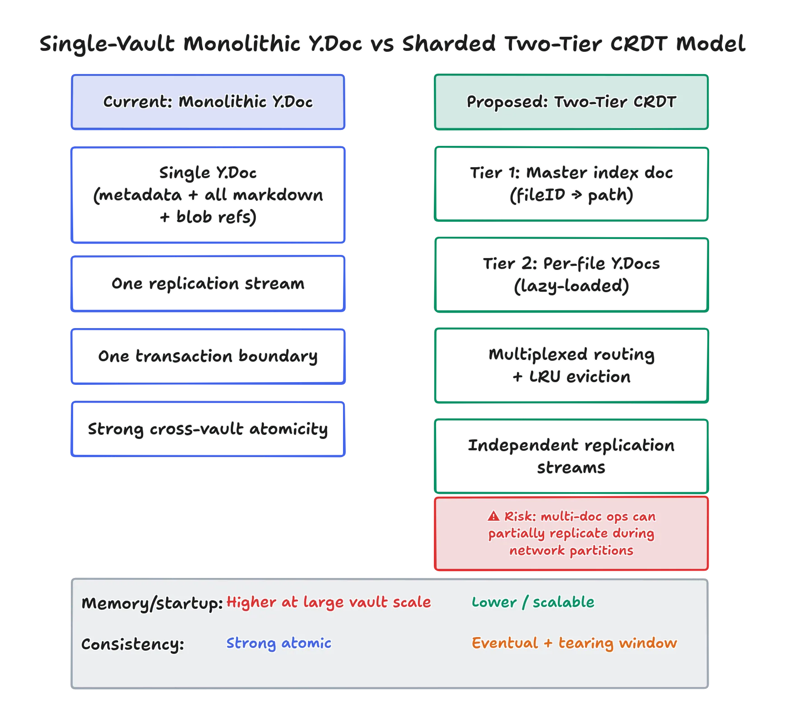

# Monolithic Architecture

The current YAOS architecture uses a single, shared Y.Doc for the entire vault - file metadata, folder structures, blob references, and all markdown Y.Text values.

For small and medium personal vaults (roughly 50 MB of raw text — see the ceiling discussion below for what that number is actually made of), this gives:

- simple synchronization semantics
- strong real-time collaboration behavior
- easy snapshotting
- and perfect cross-vault ACID transactions.

If a user renames a folder containing 50 markdown files, YAOS batches that into a single ydoc.transact() block. Either all 50 files move, or none of them move. The vault structure can't tear.

The tradeoff is that this design has a scaling ceiling, and the ceiling is memory rather than disk. One vault means one in-memory Y.Doc, and a Durable Object isolate gets 128 MB.

Measurement moved that number around a lot. A cold-loaded document is cheap: about 1.16 bytes per character for ASCII content and 2.1 for UTF-16, so 112 MB of text cold-loads into 130 MiB of heap. A *warm* document — one that has been absorbing edits rather than decoded once — costs 4-7x a freshly cold-loaded document holding identical state. Production agrees: hourly peaks over 48 hours on one real vault's Durable Object ran 3.3 MiB at the low end, 36.0 MiB median, 64.4 MiB at peak, for a document whose encoded state is 3.66 MB. Hibernation does not reclaim it.

The dominant cost is not Yjs item overhead, which is what we assumed. Yjs merges adjacent inserts from the same client by concatenating their strings, and V8 answers `str += str` with a rope node instead of a flat string. Nothing ever flattens it, so a long editing session grows a deep tree of cons cells over what is logically one paragraph.

That distinction is the reason the monolith survives. An architectural memory cost would have forced sharding; an implementation artefact can be fixed in place. Re-materialising the document — encoding its own state and decoding it into a fresh Y.Doc — collapses the ropes and returns the document to its cold-load footprint, recovering 71-77% of the drift at realistic edit locality. At pathological locality (switching note on every single edit) only 36-41% comes back, because item fragmentation really is in the data structure and no re-encode recovers it. Both figures are the observed spread across five runs of `scripts/bench-warm-memory.mjs`; any single run reads two or three points tighter than the truth. So the practical ceiling is roughly 11 MB of vault without periodic re-materialisation, and roughly 50 MB with it.

Tombstones and history pay rent too, but less than we feared, and we now collect some of it back: once a file has been tombstoned long enough, its Y.Text body is reclaimed while the tombstone itself is kept, so deleted files stop carrying their content without breaking delete propagation to devices that were offline.

We estimate that 70-80% of Obsidian users write notes like normal humans and want a fast, local-first Apple-Notes-on-steroids alternative. But we acknowledge that the small group of users who use Obsidian to ingest 10,000 auto-generated logs, scrape Wikipedia, and dump gigabytes of academic PDFs into one folder.

Loading a 10GB vault's history into a single in-memory CRDT graph would immediately trigger an Out of Memory crash on mobile devices. This is why Obsidian Sync uses dumb, debounced file-level syncing, because it has an O(1) memory ceiling per file. It doesn't care if your vault is 1MB or 50GB; it just moves files around and relies on "File modified externally" popups when things collide.

We made the opposite trade. YAOS trades infinite scalability for perfect real-time ergonomics.

To bypass the memory ceiling while keeping real-time sync, *we could shard the CRDT per-file*, which is actually how Apple Notes works:

- Local-First Database: The source of truth is a local SQLite database (CoreData). The folder structure, metadata, and note list live here.
- Per-Note CRDTs: Apple does use a custom CRDT implementation for the rich text and tables inside the notes, but it is strictly scoped per note. They serialize the note content using Protocol Buffers and sync it via CloudKit.
- Dumb Metadata Sync: The folder hierarchy and note metadata (creation date, tags) do not use CRDTs. They use standard CloudKit conflict resolution, which is usually just Last-Writer-Wins (LWW) based on timestamps.
- Aggressive Garbage Collection: Unlike Yjs, which retains every deletion tombstone forever (unless you explicitly write a garbage collection layer), Apple Notes aggressively prunes edit history once the CloudKit server confirms the sync. This keeps the protocol buffer payloads tiny.

To achieve this in YAOS, we would have to build a Two-Tier CRDT System:

**Tier 1 (The Master Index)**: A vault-level CRDT holding only metadata (fileID -> path). It syncs immediately on startup.

**Tier 2 (Lazy-Loaded Leaf Docs)**: Each markdown file gets a dedicated Y.Doc. When a user opens foo.md, the client dynamically instantiates the doc, fetches its history, and subscribes to its updates.

We don't do this because this is a major refactor with complex consistency boundaries, and Apple's custom CRDT is actually worse at handling heavy concurrent edits than my Yjs implementation. Yjs is mathematically more robust.

Because browsers only allow a few WebSocket connections, this requires building a custom multiplexed router, and we would have to build an LRU to constantly evict idle Y.Doc instances from memory (because the nature of the Actor model is such that individual objects have small limits).

The problem is, when you split a single monolithic state graph into thousands of independent CRDT instances, you fundamentally decouple their replication streams. A multi-document operation, such as updating a structural reference in the Master Index while simultaneously modifying the target Leaf Doc—can no longer be committed as a single atomic transaction.

If a network partition interrupts the synchronization process, the system state tears. Document A may successfully replicate to the remote server while Document B remains stranded on the local client. To a remote observer, the vault's referential integrity is broken. Links between documents can break, metadata no longer lines up with the actual content, and related changes show up in the wrong order.

By sharding the state, you downgrade the system's cross-vault guarantees from *strong transactional consistency to eventual consistency*. The CRDTs will mathematically converge once the network fully stabilizes, but the intermediate states exposed to the system, and the user, will be semantically invalid.

Enterprise systems like Figma and Notion accept this tearing. They trade strong consistency for identity preservation and memory scalability. Because the content is bound to a stable fileID rather than a fragile file path, no data is permanently lost. However, they write defensive UI code to hide broken references, handle dangling pointers, and mask the eventual consistency delay from the user.

YAOS has a debug mode, which shows vault-footprint. After doing QA, I saw that my vault's `encodedDocBytes` was 25KB larger than the total live markdown text, which is roughly a **1.9% overhead.** Essentially, the CRDT state is lean, and history/tombstones are not bloating the document much at all.

That figure is about *encoded* size — what the CRDT costs on the wire and in storage — and it still holds. It is not a memory number. Memory is the rope story above, and it is a much larger multiple; both have to stay bounded for the monolith to work, and with periodic re-materialisation both do.

When the encoded overhead is 2% and the memory overhead turns out to be a fixable rope rather than the architecture, abandoning the monolith's ACID guarantees is severe over-engineering. We will cherish the monolith until the profiler proves we have no other choice.
